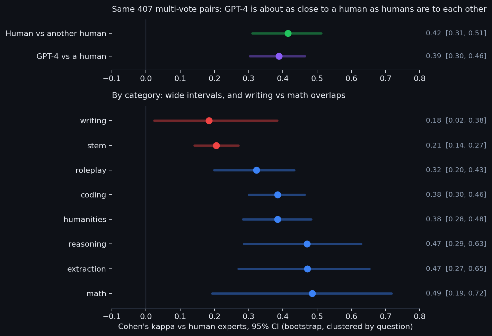
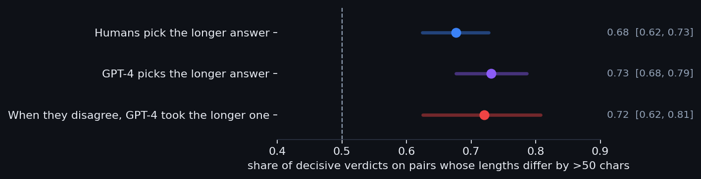

# JudgeLab - How Much Can You Trust an LLM as a Judge?

**GPT-4-as-a-judge, measured against 3,355 real human expert votes with question-clustered confidence intervals. Headline: GPT-4 agrees with a human expert about as well as a second human expert does (kappa 0.39 vs 0.42 on the same pairs). But 15.8% of its verdicts flip when the two answers swap places, and when it overrules the humans it takes the longer answer 72% of the time.**

[](https://github.com/PSPMANI/judgelab/actions/workflows/ci.yml)
[](https://judgelab-lzmmbppjsxunkqizxvrdvv.streamlit.app/)


**Live demo:** https://judgelab-lzmmbppjsxunkqizxvrdvv.streamlit.app/

> **What this is:** every RLAIF pipeline and automated eval quietly assumes an LLM judge
> can be trusted. JudgeLab measures that assumption on real, public data (the MT-Bench
> human study), puts error bars on every number, and compares the judge against the only
> fair baseline: another human. Companion project to
> [TrajLens](https://github.com/PSPMANI/trajlens), which grades agents with deterministic
> rubrics; JudgeLab measures the automated judge itself.

---

## Findings (95% CIs, bootstrap resampling whole questions)



| Question | Answer | Evidence |
|---|---|---|
| How often does GPT-4 match the human majority? | 68.4% of all verdicts, 87.1% of decisive ones | kappa **0.41** [0.35, 0.47]; decisive **0.46** [0.35, 0.58] |
| Is that bad? | **No worse than a second human.** | Same 407 multi-vote pairs: human vs human kappa **0.42** [0.31, 0.51], GPT-4 vs human **0.39** [0.30, 0.46] |
| Is it position-consistent? | **No:** 15.8% of verdicts flip when the answers swap seats | 380 of 2,400 judgments, CI [13.9%, 18.0%] |
| Does abstaining on those help? | Raw agreement 68.4% → 71.5% at 84% coverage, **kappa unchanged** (0.40 vs 0.41) | the dropped cases were ties either way |
| Is it biased toward length? | **When it overrules humans, yes:** it takes the longer answer **72%** [63%, 81%] of the time | overall preference 73% vs humans' 68% overlaps; the disagreement test does not |
| Is it weakest on writing? | **Not shown.** Writing has the lowest kappa (0.18) but the writing-to-math gap of 0.30 has CI [-0.05, 0.62] | 10 questions per category is too few to rank categories; STEM [0.14, 0.27] is the one clearly low one |



### What changed from v1, and why it matters

Version 1 of this project reported point estimates and read them the obvious way:
"kappa 0.46 is only moderate" and "reliability collapses on writing". Adding two things
changed both conclusions:

1. **A human baseline.** Kappa 0.4 sounds mediocre until you measure human experts against
   each other on the same pairs and get 0.42. The ceiling is the ambiguity of the task,
   not the judge. (This replicates the MT-Bench paper's conclusion, here derived from the
   raw votes.)
2. **Clustered confidence intervals.** Each category has only 10 questions, so its kappa
   interval is wide, and the writing-vs-math gap is not statistically distinguishable from
   zero. A naive pair-level bootstrap would have hidden this by treating the ~15 pairs per
   question as independent.

The robust findings that survive the error bars are position inconsistency and the length
bias in disagreements. Those are the ones to design around: judge both orders, and audit
cases where the judge overrules humans in favour of the longer answer.

## The data (real, public, keyless)

- `lmsys/mt_bench_human_judgments` on Hugging Face, released with the MT-Bench paper
  (Zheng et al., 2023, "Judging LLM-as-a-Judge with MT-Bench and Chatbot Arena").
- 3,355 pairwise votes from 65 human experts on answers from 6 real models
  (GPT-4, GPT-3.5, Claude-v1, Vicuna-13B, Alpaca-13B, LLaMA-13B).
- 2,400 GPT-4 pairwise judgments on the same pairs, each judged in both answer orders.
- Joined on identical (question, model pair, turn): 1,232 directly comparable pairs; 407 of
  them have two or more human votes, which is what the human baseline uses.

No LLM API is called anywhere: the judge being measured already did its judging in the
published dataset.

## Reproduce every number

```bash
pip install -e ".[dev]"
python analyze.py              # every statistic, offline, deterministic seed (~10 s)
python analyze.py --check      # exit 1 if data/stats.json drifts from the data
python scripts/make_figures.py # regenerate the figures above
pytest                         # 14 tests, including the real-data checks
```

`python prepare_data.py` re-downloads the public dataset (no key, rate-limited, resumable)
and rebuilds `data/mtbench_compact.json.gz`, a 32 KB file holding every vote and verdict
without the long answer texts. That file is committed, so CI regenerates every published
number from it on every push and fails if any number has drifted.

## Project layout

| File | Role |
|---|---|
| [`judgelab/stats.py`](judgelab/stats.py) | multi-class Cohen's kappa, question-clustered bootstrap |
| [`judgelab/analysis.py`](judgelab/analysis.py) | headline, human baseline, position, selective judging, verbosity, categories |
| [`judgelab/data.py`](judgelab/data.py) | build and load the compact dataset |
| [`analyze.py`](analyze.py) | compute `data/stats.json`; `--check` for CI |
| [`app.py`](app.py) | the Streamlit app: reliability report, bias analysis, disagreement gallery, methodology |

The analysis is pure standard library; Streamlit, pandas and altair are only for the app.

## Run the app locally

```bash
pip install -r requirements.txt
streamlit run app.py
```

## Honest limits

- Human majorities on few votes per pair are themselves noisy. Ties are analysed both
  included and excluded, and the human baseline uses only multi-vote pairs.
- Per-category intervals are wide (10 questions each). Treat category rankings as
  hypotheses to test with more questions.
- Verbosity is an observational association, not a randomized length manipulation.
- One judge (GPT-4, 2023) on one benchmark. The numbers are dated by design; the method,
  including the baseline and the clustered intervals, is the transferable part.

## Why this matters

If you train against AI feedback (RLAIF) or rank models with an LLM judge, the judge's
biases become your model's biases. "We used GPT-4 as a judge" is a methods sentence. "Our
judge matches human experts about as well as they match each other, flips 16% of verdicts
on answer order, and favours length when it overrules them" is an evaluation. This project
is the second sentence, with error bars.
